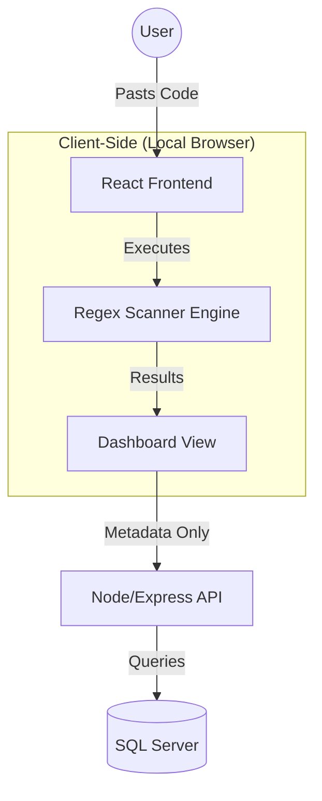
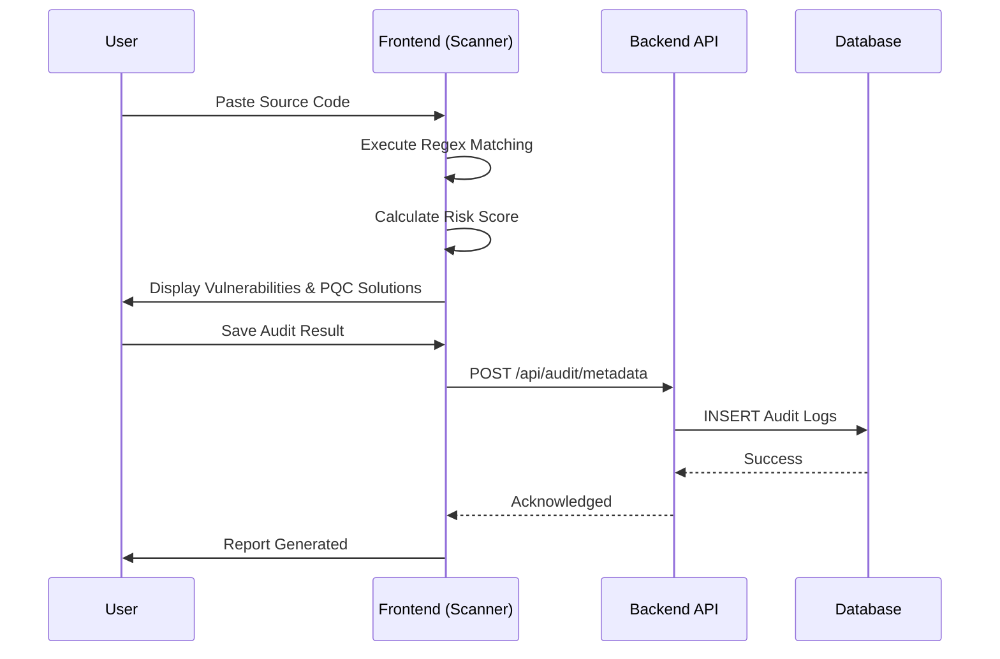

# QuantumGuard: Project Workflow & Architecture Report

## 1. Executive Summary
**QuantumGuard** is an enterprise-grade security auditing and migration platform designed to address the "Q-Day" cryptographic crisis. It enables organizations to discover legacy, quantum-vulnerable cryptographic primitives within their codebases and provides automated, NIST-standardized remediation paths using Post-Quantum Cryptography (PQC).

---

## 2. System Architecture
The project follows a **Three-Tier Architecture** to ensure security, scalability, and separation of concerns.

### 2.1 Technology Stack
*   **Frontend**: React.js (Vite), CSS3 (Custom Properties), Glassmorphism UI.
*   **Backend**: Node.js & Express.js.
*   **Database**: Microsoft SQL Server (MSSQL).
*   **Security**: Client-side Static Application Security Testing (SAST) engine.

### 2.2 Data Flow & Isolation
To protect Intellectual Property (IP), the **Scanner Engine** executes entirely in the user's browser. Proprietary source code is never transmitted to the backend; only anonymized metadata and audit results are persisted.

---

## 3. Core Workflow Processes

### 3.1 Authentication & Role-Based Access Control (RBAC)
The system supports three distinct user personas, each with tailored dashboards:
1.  **Administrators**: Global analytics, user management, and system telemetry.
2.  **Organizations**: Core auditing, PQC remediation, and compliance reporting.
3.  **Researchers**: Educational portal and PQC theoretical documentation.

### 3.2 The Cryptographic Audit Lifecycle
This is the primary workflow for organizational users:

1.  **Ingestion**: User pastes source code into the interactive editor.
2.  **Discovery**: The Regex engine identifies vulnerable primitives (RSA, MD5, ECC, etc.).
3.  **Analysis**: The system calculates a "Vulnerability Impact Score" based on severity weights.
4.  **Remediation**: The UI presents side-by-side comparisons of legacy code vs. NIST-compliant PQC code (e.g., ML-KEM).
5.  **Reporting**: Generation of an immutable HTML/PDF compliance record.

---

## 4. Implementation Strategy

### 4.1 UI/UX Design Philosophy
*   **Glassmorphism**: Translucent panels and deep shadows for a "premium security terminal" feel.
*   **Dynamic Theme Engine**: CSS variables allow instant switching between "Cyber Dark" and "Clinical Light" modes without page reloads.
*   **Micro-Animations**: Hover effects, loading states, and scanline transitions to enhance engagement.

### 4.2 Security & Integrity
*   **Parameterized Queries**: Absolute protection against SQL Injection.
*   **Local Compute**: Source code stays in RAM, mitigating data breach risks.
*   **Deterministic Mapping**: Precise correlation between legacy algorithms and their specific PQC replacements.

---

## 5. Future Roadmap
*   **CI/CD Integration**: Direct GitHub/GitLab repository scanning via OAuth.
*   **Semantic Analysis**: Moving from Regex to Abstract Syntax Tree (AST) parsing for higher precision.
*   **AI Heuristics**: Machine learning models to detect obfuscated cryptographic patterns.

---

> [!TIP]
> **To Export as PDF**:
> 1. Open this report in your browser or Markdown viewer.
> 2. Use the "Print" function (`Ctrl + P`).
> 3. Select "Save as PDF" as the destination.
